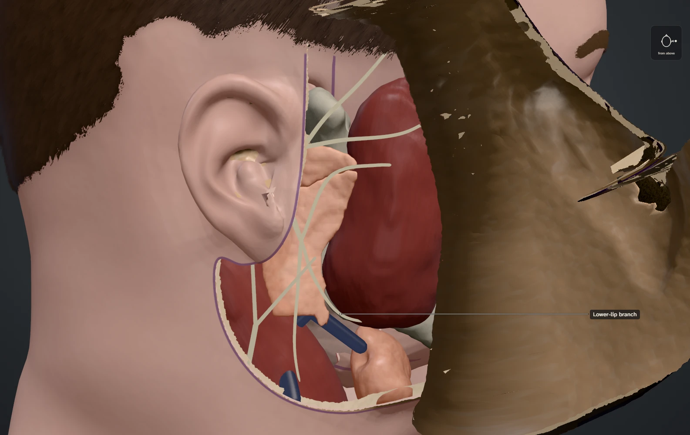

# Parotid Atlas

An interactive, scroll-driven 3D atlas of parotid tumours and parotidectomy, with pleomorphic adenoma as the representative case.



## Overview

Parotid Atlas explains the operation through one continuous dissection that you can reverse at any point. As you scroll, the head is opened layer by layer: skin, fat and SMAS, then the gland, the facial nerve, the tumour and the surgical plane. Fifty-four authored plates show the tumour's relationship to the facial nerve at reading levels from lay to clinical. The anatomy is reconstructed from the U.S. National Library of Medicine's Visible Human male CT, using a reproducible pipeline and cited specifications.

## Key capabilities

- **Continuous, reversible dissection.** Scrolling backwards, deep links and cold loads all resolve to the same scene state.
- **Three reading levels.** Every claim can be read at the Essentials, Anatomy or Clinical level.
- **An instrument for the scene.** A depth dial ghosts or hides each tissue family. Alongside it are view buttons, labelled structures and structure cards.
- **Explore mode.** After the narrative ends you can freely inspect the gland, nerve, tumour, muscle and bone.
- **Evidence-backed text.** Every paragraph is either a sourced `<Claim>` or a `<Model>` note about how the atlas draws things. A validator enforces this, along with source status and asset provenance.
- **Reproducible anatomy.** The geometry is generated from source data and editable YAML specifications, with automated topology and relationship checks.
- **Accessible.** The site has a semantic static tier, a reduced-motion path, announcements when a plate settles and a print stylesheet. Reference pages cover the method, credits and a glossary.

## Technology

- [Astro](https://astro.build/) 7 with MDX for the site and plate content
- [three.js](https://threejs.org/) r186 with a WebGPU renderer and WebGL2 fallback, and TSL node materials
- TypeScript npm workspaces: a content schema, a timeline engine and a renderer stage
- Vitest for unit tests, and Playwright (Chrome) for capture, accessibility and performance checks
- A Python 3.12 anatomy pipeline (TotalSegmentator, NumPy, SciPy, scikit-image, trimesh), with meshes compressed by gltf-transform (meshopt)

## Getting started

You need Node.js 24 or later and npm.

```bash
git clone https://github.com/mattkoczwara/parotidectomy-flythrough.git
cd parotidectomy-flythrough
npm ci
npm run dev
```

The dev server prints a local URL. A browser with WebGPU works best; others fall back to WebGL2.

The built anatomy asset is committed (`apps/site/public/assets/anatomy/`), so the site runs without the Python pipeline. To rebuild the anatomy from source data, see [`pipeline/README.md`](pipeline/README.md).

## Production build

```bash
npm run build      # static site in apps/site/dist
npm run preview    # serve the production build locally
npm run check      # typecheck, unit tests, content/evidence validation and build
```

Other scripts:
- `npm run validate` checks content, evidence and asset provenance.
- `npm run build:public` refuses to build while any claim is unverified or not clinically approved.
- `npm run capture` runs the Playwright suite on the production build.

## Project structure

| Path | Contents |
|---|---|
| `apps/site` | Astro site. The plates are MDX in `src/content/steps`. |
| `packages/schema` | Shared content contracts |
| `packages/timeline` | Derives scene state from a timeline position |
| `packages/stage` | three.js renderer |
| `pipeline` | Reproducible anatomy generation from sources and specs |
| `tools/validate`, `tools/capture` | Content/evidence validation, and browser capture tests |
| `docs` | Plan, status, ADRs, QC log, benchmarks and performance records |

## Status

The implementation is complete. All 54 plates are authored, the capture suite and the automated anatomy checks pass, and the four visual benchmarks are approved. **Clinical review has not started.** Every claim is still `clinicalReview: pending`, so the public build gate refuses to build. The site has not been tested on Safari or on real phones. See [`docs/STATUS.md`](docs/STATUS.md) for details.

## Medical disclaimer

Parotid Atlas is an educational illustration, not medical advice. It shows one representative operation, not universal practice, and its content has not yet been reviewed by a clinician. Do not use it to make decisions about diagnosis or treatment. Consult a qualified clinician.

## License

The source code is released under the [MIT License](LICENSE).

Third-party data, models and fonts keep their own terms. Each one's source, licence and obligations are recorded in [`apps/site/src/content/assets`](apps/site/src/content/assets) and shown on the site's Credits page. Anatomy data courtesy of the U.S. National Library of Medicine (Visible Human Project), which does not endorse this project. The atlas also uses the HuBMAP Human Reference Atlas (CC BY 4.0), TotalSegmentator (Apache-2.0), MakeHuman/MPFB assets (CC0) and fonts under the SIL Open Font License.
